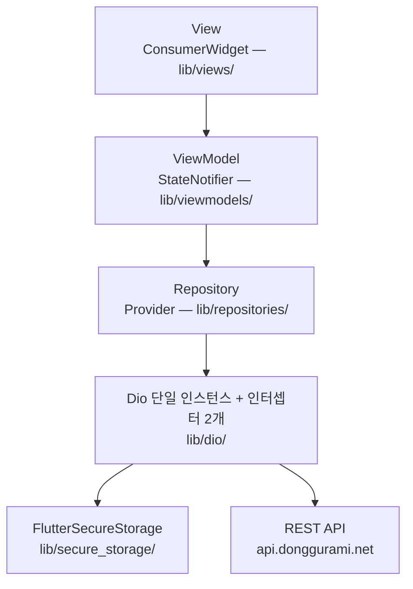
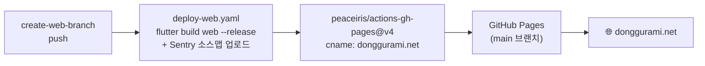

<div align="center">


# 동구라미

**수원대학교 동아리 지원 플랫폼** — 동아리 탐색부터 지원서 제출, 합격 확인까지


[](https://github.com/2jang/USW-Circle-Link-APP/actions/workflows/deploy-web.yaml)

**🌐 웹 서비스 바로가기 → [donggurami.net](https://donggurami.net)**

</div>

---

## 📢 서비스 상태 안내

> **모바일 앱(iOS/Android)은 2025년 10월 서비스 종료되었으며, 웹으로 전환되어 현재 운영 중입니다.**
>
> - 현재 서비스: **웹** — https://donggurami.net
> - 앱 서비스 종료는 인앱 업데이트 피드(appcast) 채널을 통해 기존 앱 사용자에게 공지되었습니다.
> - 이 저장소의 실제 소스 코드는 **`create-web-branch`** 브랜치에 있습니다. ([브랜치 안내](#-저장소-구조-브랜치-안내) 참고)

## 📘 프로젝트 소개

**동구라미**는 수원대학교 학생을 위한 동아리 지원 플랫폼입니다. 수원대 포털 이메일(`@suwon.ac.kr`) 인증으로 가입한 학생이 동아리를 탐색하고, 지원서를 제출하고, 합격 여부를 푸시 알림으로 받아볼 수 있습니다.

| 구분 | 기간 | 내용 |
|---|---|---|
| 모바일 앱 개발·운영 | 2024-06 ~ 2025-08 | Flutter 앱(iOS 13.0+ / Android) 개발, App Store·Google Play 출시, v1.0.1~1.0.11 |
| 웹 전환·운영 | 2025-09 ~ 2025-11 | Flutter Web 전환, Sentry 도입, GitHub Pages 자동 배포 체계 구축 |
| 현재 | 2025-11 ~ | 웹([donggurami.net](https://donggurami.net)) 운영 중, 앱은 서비스 종료 |

**스토어 출시 이력** (앱 서비스는 종료되었습니다):
- [App Store — 동구라미 (id6692607046)](https://apps.apple.com/kr/app/%EB%8F%99%EA%B5%AC%EB%9D%BC%EB%AF%B8/id6692607046)
- [Google Play — com.usw.flag.temp.usw_circle_link](https://play.google.com/store/apps/details?id=com.usw.flag.temp.usw_circle_link)

## ✨ 주요 기능

| 기능 | 설명 |
|---|---|
| 로그인 / 회원가입 | 2트랙 가입 — 신규 회원(포털 이메일 인증) / 기존 동아리 회원(회장 승인 대기) |
| 동아리 탐색·필터 | 「전체」/「모집 중」 탭, 분과별(학술·종교·예술·체육·공연·봉사) 그룹, 카테고리 최대 3개 필터 |
| 동아리 상세 | 소개·모집글 탭, 사진 캐러셀·핀치줌 갤러리, 동아리방 위치(층별 안내도)·연락처·인스타그램 |
| 지원하기 | 지원 가능 여부 사전 검증 → 인앱 웹뷰로 지원 폼 작성 → 지원 확정 |
| 지원 현황 | 「대기 중」/「합격」/「불합격」 상태 배지로 확인 |
| 공지사항 | 비로그인 열람 가능, 이미지 갤러리(스와이프·줌) |
| 푸시 알림 (FCM) | 합격 여부 알림 수신, 알림 이력 패널 |
| 프로필 관리 | 내 정보 수정(비밀번호 재확인), 비밀번호 변경·찾기, 아이디 찾기, 회원탈퇴 |

## 🎥 스크린샷 / 데모


- [🎬 동구라미 시연 영상 보기](https://linktr.ee/woochang4862)
- [🌐 웹 서비스 직접 사용해 보기](https://donggurami.net)

## 🛠️ 기술 스택

| 분류 | 기술 |
|---|---|
| 프레임워크 | Flutter (stable 채널), Dart SDK `>=3.2.2 <4.0.0` |
| 상태관리 | flutter_riverpod (StateNotifier 중심) |
| 라우팅 | go_router (25개 라우트, 중첩 구조) |
| 네트워크 | dio + retrofit, connectivity_plus, logger |
| 저장소 | flutter_secure_storage(토큰) · shared_preferences(알림 이력) |
| Firebase | firebase_core · firebase_messaging(FCM) · firebase_analytics |
| 모델/코드젠 | freezed + json_serializable + build_runner |
| 모니터링 | sentry_flutter · sentry_dio (웹 전환기 도입, CI에서 소스맵 업로드) |
| UI | flutter_screenutil, flutter_html, flutter_svg, photo_view, carousel_slider |
| 웹뷰 | flutter_inappwebview (지원 폼·포털 메일·약관 렌더링) |

## 🚀 시작하기 (로컬 실행)

사전 요건: [Flutter SDK](https://docs.flutter.dev/get-started/install) stable 채널 (Dart SDK 3.2.2 이상)

```bash
# 1. 저장소 클론 — 실소스는 create-web-branch입니다
git clone -b create-web-branch https://github.com/2jang/USW-Circle-Link-APP.git
cd USW-Circle-Link-APP

# 2. 의존성 설치
flutter pub get

# 3. 코드 생성 (freezed · retrofit · json_serializable)
dart run build_runner build --delete-conflicting-outputs

# 4. 웹으로 실행 / 빌드
flutter run -d chrome
flutter build web --release
```

> 접속 서버 전환은 `lib/const/data.dart`의 컴파일 타임 상수로 이루어집니다(기본값: 운영 서버). 실행 시 별도 환경 변수는 필요하지 않습니다.

## 🏗️ 아키텍처

MVVM + Repository 패턴을 Riverpod으로 구현했습니다. 모든 화면이 동일한 계층 흐름을 따릅니다.



**설계 특징 3가지**

1. **TokenInterceptor 토큰 추상화** — Repository는 헤더에 플래그(`accessToken: true`)만 넣고, 인터셉터가 저장된 실제 토큰으로 치환합니다. 401 발생 시 리프레시 토큰으로 자동 재발급 후 원 요청을 재시도하고, 실패하면 자동 로그아웃합니다.
2. **ErrorUtil 에러 중앙화** — 서버 에러 코드(`USR-*`, `APT-*` 등)를 사용자 메시지·입력 필드에 매핑하는 로직을 싱글톤 하나로 일원화했습니다.
3. **AsyncValue 에러 채널 패턴** — 에러를 `AsyncValue.error`가 아닌 전용 에러 모델로 감싸 `AsyncValue.data` 채널로 흘려, 화면별 에러 코드 분기를 모델 타입으로 처리합니다.

**디렉토리 구조** (`create-web-branch` 기준, Dart 파일 총 192개)

| 디렉토리 | 파일 수 | 역할 |
|---|---|---|
| `lib/models/` | 68 | freezed 요청/응답·에러 모델 |
| `lib/views/` | 46 | 화면·위젯 (ConsumerWidget) |
| `lib/viewmodels/` | 40 | StateNotifier 기반 ViewModel |
| `lib/utils/` | 13 | ErrorUtil, 입력 검증 정규식 등 공용 유틸 |
| `lib/repositories/` | 11 | API 호출 캡슐화 |
| `lib/router/` | 3 | go_router 라우트 정의 |
| `lib/dio/` · `lib/secure_storage/` | 2 | Dio 인스턴스·인터셉터, 토큰 저장소 |
| `lib/notifier/` · `lib/const/` · `lib/common/` | 7 | 전역 notifier, 상수, 공통 위젯 |

레이어별 설계 원칙과 팀 개발 가이드라인은 [docs/ARCHITECTURE_GUIDE.md](https://github.com/2jang/USW-Circle-Link-APP/blob/create-web-branch/docs/ARCHITECTURE_GUIDE.md)를 참고하세요.

## 🌿 저장소 구조 (브랜치 안내)

**소스 코드를 찾는다면 `create-web-branch`를 보세요.** 기본 브랜치 `main`은 소스가 아니라 배포 산출물입니다.

| 브랜치 | 역할 | 비고 |
|---|---|---|
| `main` | 웹 빌드 산출물 (GitHub Pages 게시 결과) | 직접 수정 금지 — 배포 커밋이 자동 누적됨 |
| **`create-web-branch`** | **실소스 (웹 전환 이후 기준 브랜치)** | **push 시 자동 빌드·배포** |
| `develop` | 구 모바일 앱 소스 | 2025-08 이후 동결 |
| `service-end` | 앱 종료 공지(appcast 문구 교체) 기록 | 전환기 기록용 |

## 📦 빌드·배포

`create-web-branch`에 push하면 웹 빌드부터 배포까지 자동으로 진행됩니다.



- 워크플로: [.github/workflows/deploy-web.yaml](https://github.com/2jang/USW-Circle-Link-APP/blob/create-web-branch/.github/workflows/deploy-web.yaml) — `pubspec.yaml`의 버전을 릴리스 태그(`usw_circle_link@<version>`)로 사용해 소스맵과 함께 Sentry에 업로드합니다.
- 인증 정보(Sentry 토큰 등)는 GitHub Actions Secrets로만 주입되며 저장소에 포함되지 않습니다.
- 앱 시절에는 `deploy_prod.yaml`이 fastlane으로 iOS TestFlight·Google Play 내부 트랙에 순차 배포했으나, 앱 서비스 종료와 함께 사용이 중단되었습니다.

## ⚠️ 알려진 제약 (Known Issues)

앱 소스(develop 기준) 분석에서 확인된 주요 제약입니다. 후속 작업 시 참고하세요.

| # | 제약 | 영향 |
|---|---|---|
| 1 | 라우트 인증 가드 미동작 — 리다이렉트 로직이 GoRouter `redirect:`에 연결되지 않은 죽은 코드 | 인증 제어가 화면/API 레벨에만 의존 |
| 2 | 푸시 알림 딥링크 미구현 | 알림을 눌러도 관련 화면으로 이동하지 않음 |
| 3 | 토큰 재발급 동시성 제어 부재 | 동시 401 시 중복 재발급으로 연쇄 로그아웃 가능 |
| 4 | 지원 완결성 미검증 — 외부 웹 폼의 실제 제출 여부를 확인하지 못함 | 폼 미작성 상태로 지원 확정 가능 |
| 5 | 단과대·학과 목록 하드코딩(9개 단과대·77개 학과) | 학제 개편 시 코드 수정·재배포 필요 |
| 6 | 오류 복구 UX 부재 — 재시도 버튼·pull-to-refresh 없음 | 오류 시 화면 재진입에 의존 |
| 7 | 테스트용 서버 주소·계정이 소스에 하드코딩되어 있음 | 값은 공개 문서에 기재하지 않음 — 제거·비밀값 분리 권장 |

## 👥 팀 / 히스토리

| 이름 | 커밋 | 역할 |
|---|---|---|
| 정우창 (Woochang4862) | 326 | 리드 개발자 — 기능 개발, CI/CD, 릴리스, 서비스 종료·웹 전환 전담 |
| RnaYuta | 87 | 핵심 개발 |
| 이수빈 | 28 | 개발 참여 |

> 커밋 수는 앱 소스(develop, 총 441커밋) 기준이며, 웹 전환기(create-web-branch) 커밋은 별도입니다.

- **버전 이력**: 1.0.1(2024-11) → 1.0.2~1.0.10(2025-01~03, 출시·핫픽스) → 1.0.11(2025-07, 최종)
- **브랜치 전략(앱 시절)**: 기능 브랜치 → PR → develop → qa-test-x → 태그·스토어 배포
- **연표**: 2024-06 개발 시작 → 2024-11 첫 출시 → 2025-03 출시 스퍼트 → 2025-10 앱 종료 공지·웹 전환 → 2025-11~ 웹 운영

## 🔗 문서 / 관련 링크

| 링크 | 설명 |
|---|---|
| [donggurami.net](https://donggurami.net) | 웹 서비스 (운영 중) |
| [api.donggurami.net](https://api.donggurami.net) | 운영 API 서버 |
| [USW-Circle-Link-Server](https://github.com/2jang/USW-Circle-Link-Server) | 백엔드 저장소 |
| [docs/ARCHITECTURE_GUIDE.md](https://github.com/2jang/USW-Circle-Link-APP/blob/create-web-branch/docs/ARCHITECTURE_GUIDE.md) | 팀 개발 가이드라인 (아키텍처·레이어·테스트 전략) |
| [deploy-web.yaml](https://github.com/2jang/USW-Circle-Link-APP/blob/create-web-branch/.github/workflows/deploy-web.yaml) | 웹 자동 배포 워크플로 |
| [App Store 출시 이력](https://apps.apple.com/kr/app/%EB%8F%99%EA%B5%AC%EB%9D%BC%EB%AF%B8/id6692607046) · [Google Play 출시 이력](https://play.google.com/store/apps/details?id=com.usw.flag.temp.usw_circle_link) | 앱 스토어 페이지 (서비스 종료) |
| [피드백 보내기](https://forms.gle/Xhang1SZiZiVyabe6) | 구글 폼 |

## 📄 라이선스

라이선스 미지정 — 무단 사용·재배포 불가.
